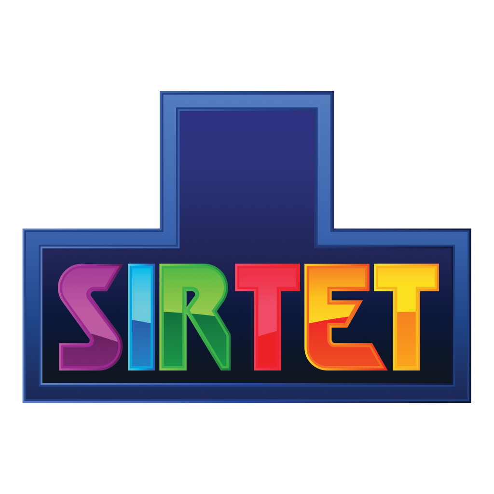

Have YOU ever wanted to play Tetris, but way more obnoxious? Do you ADORE terrible, loud noises? Do you like to HATE YOUR GAMES? Well, I have the hackathon project for you!

Introducing... Sirtet. Tetris, but with a bigger playing field, two pieces to control at once, terrible sound effects, and upside-down.

[Play it now (EPILEPSY WARNING) &raquo;](https://kognise.github.io/sirtet)

---

Notes:

- I made most of the terrible sound effects myself in Ableton!
- Built at CodeDay SF Bay Area 2020. I spent my entire first day writing a cool Chrome extension but I got bored so I wrote a Tetris clone instead. I won some prize but I forget which one.
- The `tetris` branch contains a lovely modification of this to be normal Tetris, and works entirely offline due to the merit of a lovely `fakep5.js` file. I wrote this because I wanted to play Tetris on a plane, and now whenever I'm on a plane I end up playing my shitty Tetris implementation.

Behold, a screenshot:

